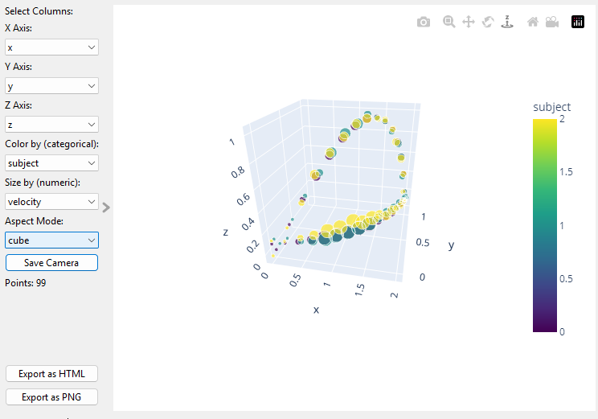
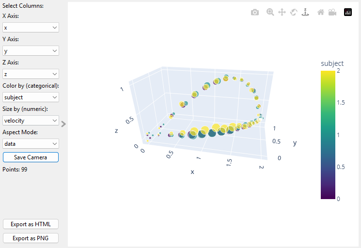

Orange3 Example Add-on
======================

This is an add-on for 
[Orange3](http://orange.biolab.si) that implements a 3D scatter plot.

Add-on can extend Orange either 
in scripting or GUI part, or in both. We here focus on the GUI part and implement a simple (empty) widget,
register it with Orange and add a new workflow with this widget to example tutorials.

Installation
------------

To install the add-on from source run

    pip install .

To register this add-on with Orange, but keep the code in the development directory (do not copy it to 
Python's site-packages directory), run

    pip install -e .

<!--
Documentation / widget help can be built by running

    make html htmlhelp

from the doc directory.
-->
Usage
-----

After the installation, the widget from this add-on is registered with Orange. To run Orange from the terminal,
use

    orange-canvas

or

    python -m Orange.canvas

The new widget appears in the toolbox bar under the section Vis3D

You can select data columns to be X, Y, and Z coordinate values.  If there is a column that identifies different datasets, you can specify that with the "Color by" selection.  By default all markers are the same size.  You can specify a column to set the marker size.  The size data will be scaled to the range 5..20 pixels.

The Aspect mode can be set to "Cube" to stretch / squeeze the data into a cube

or "data" to stretch /squeeze the plot volume to fit the data.

